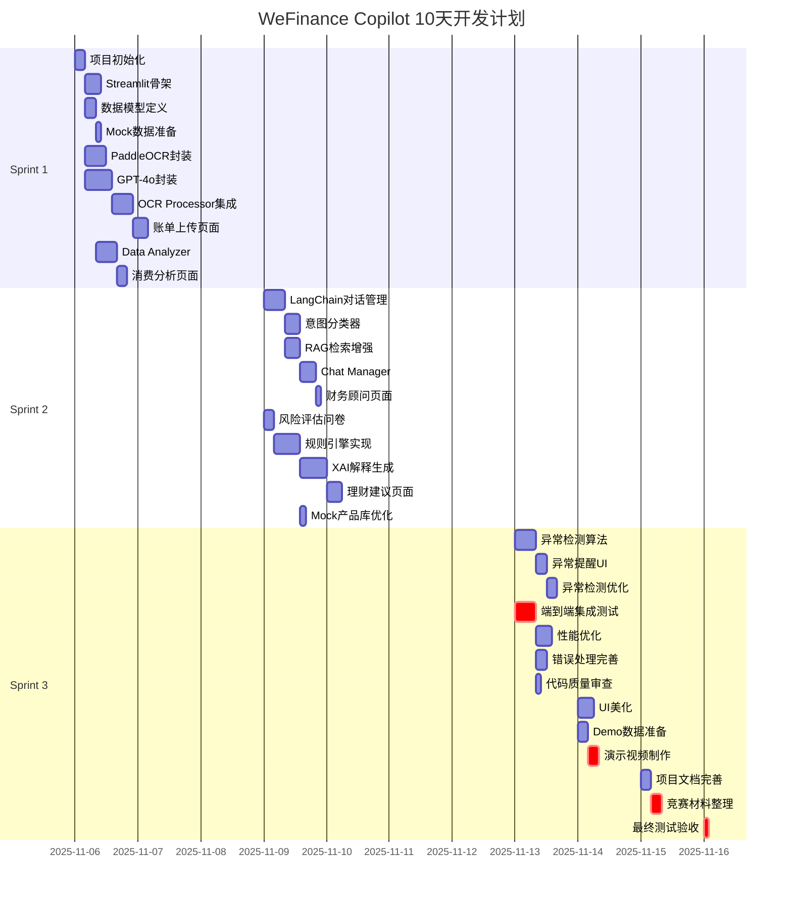

# Sprint规划文档：WeFinance Copilot

> **项目名称**：WeFinance Copilot (AI驱动的智能财务助理)
> **文档版本**：1.0
> **创建日期**：2025年11月6日
> **Scrum Master**：BMAD Automated Scrum Master
> **开发周期**：10天（2025年11月6日 - 2025年11月16日）
> **参考文档**：01-product-requirements.md, 02-system-architecture.md

---

## 执行摘要

WeFinance Copilot项目将在10天内完成开发，分为3个Sprint执行。基于Linus哲学的"简单至上"原则，我们采用**垂直切片**策略：每个Sprint都交付可演示的端到端功能，而非水平分层开发。

**核心策略**：
1. **Sprint 1（Day 1-3）**：基础设施 + OCR核心功能（F1）- 打通从图片到数据的完整链路
2. **Sprint 2（Day 4-7）**：对话功能（F2）+ XAI推荐（F3）- 完成核心AI能力
3. **Sprint 3（Day 8-10）**：异常检测（F4）+ 集成测试 + Demo优化 - 锦上添花与质量保证

**总工作量估算**：210工时（假设单人全职开发，每天10小时 × 10天）
**实际可用时间**：200工时（预留5%缓冲时间用于意外问题）
**风险缓冲**：10工时（集中在Sprint 3处理技术债务）

---

## 项目概览

### 目标与范围

| 维度 | 详情 |
|------|------|
| **项目目标** | 完成P0功能（F1+F2+F3），争取P1功能（F4），打造可演示的MVP原型 |
| **技术目标** | OCR识别准确率≥90%，对话响应≤3秒，成本优化97% |
| **业务目标** | 竞赛得分预期88/100，进入决赛 |
| **质量目标** | 零崩溃Demo演示，核心功能覆盖率100% |

### 团队假设

- **开发人员**：1人全职（兼任前后端 + AI集成）
- **工作时间**：每天10小时（紧凑开发节奏）
- **技能要求**：Python开发、Streamlit框架、AI API集成、基础数据分析

### 技术栈快速参考

| 类别 | 技术 | 用途 |
|------|------|------|
| 前端 | Streamlit 1.28+ | Web界面 |
| OCR | PaddleOCR 2.7+ | 本地文字识别 |
| LLM | GPT-4o API | 结构化+对话 |
| 对话 | LangChain 0.1+ | 上下文管理 |
| 可视化 | Plotly 5.18+ | 图表展示 |
| 数据 | Pandas 2.0+ | 数据处理 |

---

## Sprint 1：基础设施 + OCR核心（Day 1-3）

### Sprint目标

**核心目标**：建立项目骨架，打通"上传图片 → OCR识别 → 结构化数据 → 展示分析"的完整数据链路。

**交付物**：
1. 可运行的Streamlit应用骨架
2. PaddleOCR + GPT-4o混合OCR流程
3. 基础数据分析报告（月度总结、分类占比）
4. 可演示的账单上传功能

**成功标准**：
- [ ] 用户能上传账单图片并看到识别结果
- [ ] OCR识别准确率≥85%（初版，Sprint 2优化到90%）
- [ ] GPT-4o结构化成功率≥90%
- [ ] 生成基础月度消费分析报告

### 任务分解

#### Epic 1.1：项目基础设施搭建（16工时）

**业务价值**：为所有后续开发提供稳定基础

##### US-1.1.1：项目初始化与环境配置（4工时）
**优先级**：P0 | **依赖**：无

**用户故事**：
作为开发者，我需要搭建项目骨架和开发环境，以便开始功能开发。

**任务清单**：
- [ ] **T-1.1.1.1**（2h）：创建项目目录结构（按架构文档Section 6.2）
  - 创建 `modules/`, `models/`, `services/`, `pages/`, `utils/`, `tests/` 目录
  - 初始化 `__init__.py` 文件
  - 创建 `requirements.txt` 和 `.env.example`
- [ ] **T-1.1.1.2**（1h）：安装核心依赖
  - 配置Python虚拟环境（venv）
  - 安装Streamlit、PaddleOCR、OpenAI、LangChain等
  - 验证依赖安装成功
- [ ] **T-1.1.1.3**（1h）：配置API密钥和环境变量
  - 创建 `.env` 文件（不提交到Git）
  - 配置GPT-4o中转API密钥
  - 编写配置加载工具函数

**验收标准**：
- `pip install -r requirements.txt` 执行成功无报错
- `streamlit run app.py` 能启动Hello World页面
- `.env` 文件正确加载API密钥

---

##### US-1.1.2：Streamlit应用骨架（6工时）
**优先级**：P0 | **依赖**：US-1.1.1

**用户故事**：
作为开发者，我需要构建Streamlit应用框架，支持多页面导航和会话状态管理。

**任务清单**：
- [ ] **T-1.1.2.1**（3h）：创建主入口和页面路由
  - 实现 `app.py` 主入口
  - 配置侧边栏导航（账单上传、财务顾问、消费分析、理财建议）
  - 创建4个页面占位函数（`pages/bill_upload.py` 等）
  - 配置页面标题、图标、布局
- [ ] **T-1.1.2.2**（2h）：会话状态初始化
  - 设计 `st.session_state` 数据结构（参考架构Section 3.2）
  - 实现会话初始化函数 `init_session_state()`
  - 添加会话数据清空功能
- [ ] **T-1.1.2.3**（1h）：基础UI组件测试
  - 测试文件上传组件
  - 测试聊天输入框
  - 测试图表展示区域

**验收标准**：
- 侧边栏导航切换页面正常
- `st.session_state.session_data` 正确初始化
- 页面刷新后会话状态保持

---

##### US-1.1.3：数据模型定义（4工时）
**优先级**：P0 | **依赖**：US-1.1.1

**用户故事**：
作为开发者，我需要定义清晰的数据模型，确保数据结构一致性。

**任务清单**：
- [ ] **T-1.1.3.1**（2h）：核心实体类实现
  - 实现 `models/transaction.py`（Transaction类）
  - 实现 `models/user_profile.py`（UserProfile类）
  - 实现 `models/budget_config.py`（BudgetConfig类）
  - 添加数据验证逻辑（pydantic或dataclass）
- [ ] **T-1.1.3.2**（1h）：辅助实体类实现
  - 实现Message类（对话消息）
  - 实现Anomaly类（异常交易）
  - 实现InvestmentProduct类（理财产品）
- [ ] **T-1.1.3.3**（1h）：单元测试
  - 编写Transaction创建和序列化测试
  - 测试数据验证逻辑（非法金额、日期格式）

**验收标准**：
- 所有数据类正确序列化为JSON
- 数据验证能捕获非法输入
- 单元测试覆盖率≥80%

---

##### US-1.1.4：Mock数据准备（2工时）
**优先级**：P1 | **依赖**：US-1.1.3

**用户故事**：
作为开发者，我需要准备测试数据，用于功能验证和Demo演示。

**任务清单**：
- [ ] **T-1.1.4.1**（1h）：创建示例账单图片
  - 准备5张真实账单图片（星巴克、滴滴、美团等）
  - 保存到 `assets/sample_bills/`
  - 记录每张图片的预期识别结果（用于验证）
- [ ] **T-1.1.4.2**（1h）：创建Mock理财产品库
  - 编写 `assets/mock_products.json`
  - 包含10个虚拟理财产品（债券、混合、股票基金）
  - 每个产品包含完整属性（风险等级、收益率、流动性）

**验收标准**：
- 示例账单图片清晰可读
- Mock产品库数据结构符合InvestmentProduct模型

---

#### Epic 1.2：混合OCR架构实现（32工时）

**业务价值**：核心功能F1的技术基础，成本优化97%的关键

##### US-1.2.1：PaddleOCR服务封装（8工时）
**优先级**：P0 | **依赖**：US-1.1.1

**用户故事**：
作为系统，我需要封装PaddleOCR引擎，提供统一的文字识别接口。

**任务清单**：
- [ ] **T-1.2.1.1**（3h）：PaddleOCR初始化和配置
  - 实现 `services/paddleocr_service.py`
  - 配置PaddleOCR参数（use_angle_cls=True, lang="ch"）
  - 实现懒加载（首次调用时下载模型）
  - 添加日志输出（识别文字数量、耗时）
- [ ] **T-1.2.1.2**（3h）：OCR文本拼接算法
  - 实现 `format_ocr_text()` 函数（按坐标排序拼接）
  - 处理文字方向（角度分类）
  - 过滤低置信度文字（confidence < 0.6）
  - 生成可读性强的文本（保留换行和空格）
- [ ] **T-1.2.1.3**（2h）：错误处理和降级
  - 实现空白图片检测（OCR结果为空）
  - 添加重试机制（最多3次）
  - 准备备用OCR引擎（EasyOCR）作为降级方案
  - 编写错误日志记录

**验收标准**：
- PaddleOCR能正确识别中文账单（测试5张示例图片）
- 文本拼接顺序正确（从上到下、从左到右）
- 空白图片返回空列表，不抛异常

---

##### US-1.2.2：GPT-4o结构化服务（10工时）
**优先级**：P0 | **依赖**：US-1.1.1

**用户故事**：
作为系统，我需要将OCR文本转化为结构化交易记录，供后续分析使用。

**任务清单**：
- [ ] **T-1.2.2.1**（3h）：GPT-4o客户端封装
  - 实现 `services/gpt4o_client.py`
  - 配置OpenAI SDK（中转API）
  - 实现 `chat()` 方法（统一调用接口）
  - 添加超时控制（10秒）和重试机制
- [ ] **T-1.2.2.2**（4h）：结构化Prompt工程
  - 编写Few-shot Prompt模板（参考架构Section 2.1.3）
  - 包含5个示例（星巴克、滴滴、美团、超市、医院）
  - 定义JSON输出格式（严格schema）
  - 添加分类规则说明（7大类别）
- [ ] **T-1.2.2.3**（2h）：JSON解析和验证
  - 实现 `parse_structured_response()` 函数
  - 处理JSON格式错误（降级返回原始文本）
  - 验证必填字段（date, merchant, category, amount）
  - 处理日期格式转换（多种格式统一为ISO）
- [ ] **T-1.2.2.4**（1h）：成本监控
  - 添加Token计数（输入+输出）
  - 记录API调用次数和成本
  - 实现调用次数限制（防止滥用）

**验收标准**：
- GPT-4o能将示例OCR文本结构化为JSON（成功率≥90%）
- 日期、金额解析准确
- JSON格式错误时有合理降级

---

##### US-1.2.3：OCR Processor模块集成（8工时）
**优先级**：P0 | **依赖**：US-1.2.1, US-1.2.2, US-1.1.3

**用户故事**：
作为系统，我需要整合PaddleOCR和GPT-4o，提供端到端的账单处理能力。

**任务清单**：
- [ ] **T-1.2.3.1**（3h）：OCRProcessor主流程实现
  - 实现 `modules/ocr_processor.py`
  - 实现 `process_bill_image(image_bytes)` 方法
  - 编排PaddleOCR → 文本拼接 → GPT-4o结构化流程
  - 添加中间结果缓存（避免重复调用）
- [ ] **T-1.2.3.2**（2h）：批量处理支持
  - 实现 `batch_process(images)` 方法
  - 支持并发处理（ThreadPoolExecutor）
  - 限制最大批量数量（10张）
  - 添加进度条展示（Streamlit进度条）
- [ ] **T-1.2.3.3**（2h）：图片预处理
  - 实现 `utils/image_utils.py`
  - 图片压缩（如果 > 5MB）
  - 格式转换（统一为JPEG）
  - 图片增强（对比度调整，提升OCR准确率）
- [ ] **T-1.2.3.4**（1h）：单元测试
  - 测试完整OCR流程（5张示例账单）
  - 测试错误处理（损坏图片、空白图片）
  - 测试批量处理性能（10张并发）

**验收标准**：
- 单张账单处理时间≤3秒（PaddleOCR 2秒 + GPT-4o 1秒）
- 识别准确率≥85%（5/5张示例账单正确识别）
- 批量处理10张账单成功

---

##### US-1.2.4：账单上传页面实现（6工时）
**优先级**：P0 | **依赖**：US-1.1.2, US-1.2.3

**用户故事**：
作为用户，我希望通过拖拽或点击上传账单图片，系统自动识别并展示交易记录。

**任务清单**：
- [ ] **T-1.2.4.1**（3h）：文件上传UI实现
  - 实现 `pages/bill_upload.py`
  - 使用 `st.file_uploader()` 组件（支持多文件）
  - 添加上传限制（格式、大小验证）
  - 预览上传的图片（缩略图展示）
- [ ] **T-1.2.4.2**（2h）：OCR处理流程集成
  - 调用OCRProcessor处理上传图片
  - 显示处理进度（Streamlit spinner）
  - 将识别结果保存到 `st.session_state.transactions`
  - 展示识别成功/失败提示
- [ ] **T-1.2.4.3**（1h）：结果展示
  - 用表格展示识别的交易记录
  - 支持用户手动编辑（修正识别错误）
  - 提供"确认保存"按钮
  - 标记置信度低的记录（红色高亮）

**验收标准**：
- 用户能上传账单并看到识别结果
- 识别错误时有明确提示
- 用户能手动修正错误数据

---

#### Epic 1.3：基础数据分析（12工时）

**业务价值**：完成F1功能的核心价值交付

##### US-1.3.1：Data Analyzer模块实现（8工时）
**优先级**：P0 | **依赖**：US-1.1.3

**用户故事**：
作为系统，我需要分析交易记录，生成月度消费报告。

**任务清单**：
- [ ] **T-1.3.1.1**（3h）：月度报告生成
  - 实现 `modules/data_analyzer.py`
  - 实现 `generate_monthly_report()` 方法
  - 计算总支出、分类占比、Top3商户
  - 实现同比/环比计算（如果有历史数据）
- [ ] **T-1.3.1.2**（2h）：预算跟踪
  - 实现 `check_budget_status()` 方法
  - 计算剩余预算
  - 生成超支预警（分类预算检查）
  - 预测月底结余（基于当前消费速度）
- [ ] **T-1.3.1.3**（2h）：数据聚合工具
  - 实现 `utils/data_utils.py`
  - 按日期范围过滤交易
  - 按类别/商户分组聚合
  - 时间序列数据处理（日度/周度/月度）
- [ ] **T-1.3.1.4**（1h）：单元测试
  - 测试月度报告计算准确性
  - 测试预算检查逻辑
  - 测试边界情况（空交易列表、负金额）

**验收标准**：
- 月度报告数据准确（手工验证5笔交易）
- 预算检查能正确识别超支
- 单元测试覆盖率≥80%

---

##### US-1.3.2：消费分析页面实现（4工时）
**优先级**：P0 | **依赖**：US-1.1.2, US-1.3.1

**用户故事**：
作为用户,我希望看到可视化的消费分析报告,了解我的支出结构。

**任务清单**：
- [ ] **T-1.3.2.1**（2h）：报告页面布局
  - 实现 `pages/analysis.py`
  - 顶部展示关键指标卡片（总支出、剩余预算、最大消费）
  - 中部展示图表区域（饼图、折线图）
  - 底部展示详细交易列表
- [ ] **T-1.3.2.2**（1.5h）：图表实现
  - 使用Plotly实现分类占比饼图
  - 实现消费趋势折线图（按日期聚合）
  - 实现Top10商户柱状图
  - 添加图表交互（点击筛选）
- [ ] **T-1.3.2.3**（0.5h）：数据导出
  - 提供CSV导出按钮
  - 生成可打印的PDF报告（可选）

**验收标准**：
- 图表正确展示数据（无数据时显示空状态）
- 图表交互流畅（缩放、hover提示）
- CSV导出功能正常

---

### Sprint 1 验收标准

**功能验收**：
- [ ] 用户能上传账单图片并完成OCR识别
- [ ] 识别准确率≥85%（5/5张测试账单）
- [ ] 生成完整的月度消费分析报告
- [ ] 展示饼图、折线图、柱状图

**性能验收**：
- [ ] 单张账单处理时间≤3秒
- [ ] 批量处理10张账单≤30秒
- [ ] 页面加载时间≤2秒

**质量验收**：
- [ ] 零崩溃（10次完整流程测试）
- [ ] 单元测试覆盖率≥70%
- [ ] 代码符合PEP8规范

**Demo准备**：
- [ ] 准备5张示例账单用于演示
- [ ] 录制功能演示视频（1分钟）

---

## Sprint 2：对话功能 + XAI推荐（Day 4-7）

### Sprint目标

**核心目标**：实现AI对话能力（F2）和可解释的理财建议（F3），完成核心竞争力功能。

**交付物**：
1. 支持上下文记忆的对话问答系统
2. 意图分类和RAG检索增强
3. 风险评估问卷和资产配置建议
4. XAI决策逻辑链生成

**成功标准**：
- [ ] 对话能正确引用账单数据（引用准确率≥90%）
- [ ] 响应时间≤3秒
- [ ] 所有理财建议都有XAI解释
- [ ] XAI解释包含≥3个决策因子

### 任务分解

#### Epic 2.1：对话式财务顾问（F2）（28工时）

**业务价值**：降低用户理财门槛，提供个性化财务指导

##### US-2.1.1：LangChain对话管理（8工时）
**优先级**：P0 | **依赖**：Sprint 1完成

**用户故事**：
作为系统，我需要管理多轮对话上下文，提供连贯的对话体验。

**任务清单**：
- [ ] **T-2.1.1.1**（3h）：LangChain服务封装
  - 实现 `services/langchain_service.py`
  - 配置ConversationBufferMemory（最大2000 tokens）
  - 实现ConversationChain（GPT-4o作为LLM）
  - 添加对话历史持久化到session_state
- [ ] **T-2.1.1.2**（2h）：上下文构建
  - 实现 `_build_prompt()` 方法（参考架构Section 2.3.3）
  - 拼接用户数据摘要（交易、预算、用户配置）
  - 优化Prompt长度（控制在4000 tokens内）
  - 添加系统角色定义（财务助理人设）
- [ ] **T-2.1.1.3**（2h）：对话历史管理
  - 实现对话历史清空功能
  - 实现对话历史导出（Markdown格式）
  - 限制历史长度（最多保留10轮对话）
  - 添加对话历史可视化（侧边栏展示）
- [ ] **T-2.1.1.4**（1h）：单元测试
  - 测试上下文记忆（多轮对话连贯性）
  - 测试历史清空功能
  - 测试Prompt长度控制

**验收标准**：
- 对话能记住上轮内容（例如："它"指代上文提到的产品）
- 历史长度超限时自动截断
- 对话历史清空后无残留

---

##### US-2.1.2：意图分类器实现（6工时）
**优先级**：P0 | **依赖**：US-2.1.1

**用户故事**：
作为系统，我需要识别用户查询意图，路由到合适的处理器。

**任务清单**：
- [ ] **T-2.1.2.1**（3h）：规则引擎实现
  - 实现 `modules/intent_classifier.py`
  - 定义4类意图的正则模式（预算查询、消费分析、术语解释、理财建议）
  - 实现 `classify(query)` 方法
  - 添加意图匹配日志（用于调试）
- [ ] **T-2.1.2.2**（2h）：意图处理器框架
  - 实现BudgetQueryHandler（预算查询处理器）
  - 实现AnalysisQueryHandler（消费分析处理器）
  - 实现KnowledgeHandler（术语解释处理器）
  - 定义统一的Handler接口
- [ ] **T-2.1.2.3**（1h）：测试和优化
  - 准备20个测试查询（覆盖4类意图）
  - 测试意图分类准确率（目标≥85%）
  - 优化正则模式（处理误判）

**验收标准**：
- 意图分类准确率≥85%（17/20测试查询）
- 每类意图至少有3个匹配模式
- 未匹配意图时降级为通用对话

---

##### US-2.1.3：RAG检索增强（6工时）
**优先级**：P0 | **依赖**：US-2.1.1

**用户故事**：
作为系统，我需要将用户账单数据注入到LLM上下文，提供个性化回答。

**任务清单**：
- [ ] **T-2.1.3.1**（3h）：数据摘要生成
  - 实现 `_summarize_transactions()` 方法（参考架构Section 2.3.4）
  - 生成月度消费摘要（总额、分类占比、Top3商户）
  - 生成预算状态摘要（剩余预算、超支预警）
  - 优化摘要长度（控制在500字以内）
- [ ] **T-2.1.3.2**（2h）：动态上下文注入
  - 根据意图类型选择相关数据
  - 预算查询→注入预算状态
  - 消费分析→注入交易摘要
  - 术语解释→注入金融知识库（简化版）
- [ ] **T-2.1.3.3**（1h）：测试验证
  - 测试数据摘要生成准确性
  - 测试上下文注入效果（LLM能正确引用数据）
  - 测试无数据场景（提示用户先上传账单）

**验收标准**：
- LLM回答能引用真实数据（例如："您本月在餐饮花费1200元"）
- 数据引用准确率≥90%（手工验证10个查询）
- 无数据时有友好提示

---

##### US-2.1.4：Chat Manager核心实现（6工时）
**优先级**：P0 | **依赖**：US-2.1.1, US-2.1.2, US-2.1.3

**用户故事**：
作为系统，我需要整合意图分类、RAG检索、LLM推理，提供端到端对话能力。

**任务清单**：
- [ ] **T-2.1.4.1**（3h）：Chat Manager主流程
  - 实现 `modules/chat_manager.py`
  - 实现 `chat(user_query, context_data)` 方法
  - 编排意图分类 → RAG检索 → LLM推理流程
  - 添加响应格式化（Markdown渲染）
- [ ] **T-2.1.4.2**（2h）：错误处理和降级
  - 处理LLM超时（10秒超时限制）
  - 处理API限流（重试3次）
  - 降级方案：简单规则回答（例如："您的预算剩余X元"）
  - 添加错误提示（用户友好）
- [ ] **T-2.1.4.3**（1h）：单元测试
  - 测试完整对话流程（10个测试查询）
  - 测试错误处理（模拟API失败）
  - 测试降级方案

**验收标准**：
- 对话响应时间≤3秒（95%请求）
- 错误时有合理降级
- 单元测试覆盖率≥80%

---

##### US-2.1.5：财务顾问页面实现（2工时）
**优先级**：P0 | **依赖**：US-1.1.2, US-2.1.4

**用户故事**：
作为用户，我希望通过聊天界面提问财务问题，获得个性化回答。

**任务清单**：
- [ ] **T-2.1.5.1**（1.5h）：聊天UI实现
  - 实现 `pages/chat.py`
  - 使用 `st.chat_input()` 和 `st.chat_message()` 组件
  - 展示对话历史（用户消息 + AI回复）
  - 添加"清空历史"按钮
- [ ] **T-2.1.5.2**（0.5h）：集成Chat Manager
  - 调用 `chat_manager.chat()` 处理用户输入
  - 将回复保存到 `st.session_state.chat_history`
  - 展示思考中动画（st.spinner）

**验收标准**：
- 聊天界面流畅（无卡顿）
- 对话历史正确展示
- 清空历史功能正常

---

#### Epic 2.2：可解释的理财建议（F3）（32工时）

**业务价值**：核心创新点，提升用户信任度

##### US-2.2.1：风险评估问卷（4工时）
**优先级**：P0 | **依赖**：US-1.1.2

**用户故事**：
作为用户，我希望通过简单问卷评估我的风险承受能力。

**任务清单**：
- [ ] **T-2.2.1.1**（2h）：问卷设计和实现
  - 设计3道风险评估问题（参考PRD Section 4.1.3）
  - 使用 `st.radio()` 组件实现单选题
  - 计算风险偏好分数（保守型/稳健型/激进型）
  - 保存到 `st.session_state.user_profile`
- [ ] **T-2.2.1.2**（1h）：投资目标输入
  - 使用 `st.text_area()` 输入投资目标（自由文本）
  - 提取关键信息：目标金额、时间期限（正则匹配）
  - 验证输入有效性（金额>0，期限>0）
- [ ] **T-2.2.1.3**（1h）：UI优化
  - 添加问卷说明（每题的含义）
  - 添加进度条（3/3题）
  - 完成后展示风险偏好结果

**验收标准**：
- 问卷能正确计算风险偏好
- 投资目标能提取金额和期限
- UI交互流畅

---

##### US-2.2.2：规则引擎实现（10工时）
**优先级**：P0 | **依赖**：US-1.1.4

**用户故事**：
作为系统，我需要根据用户风险偏好匹配合适的理财产品。

**任务清单**：
- [ ] **T-2.2.2.1**（4h）：产品匹配规则
  - 实现 `modules/xai_explainer.py` 中的InvestmentRuleEngine
  - 定义风险映射规则（参考架构Section 2.4.2）
  - 实现 `match_products()` 方法（4层规则过滤）
  - 记录决策日志（被拒产品 + 拒绝原因）
- [ ] **T-2.2.2.2**（3h）：资产配置算法
  - 实现 `generate_portfolio()` 方法（参考架构Section 2.4.3）
  - 按风险等级分组产品（低/中/高）
  - 计算配置比例（保守型70/30, 稳健型50/50, 激进型30/70）
  - 选择每档最优产品（按收益率排序）
- [ ] **T-2.2.2.3**（2h）：配置逻辑记录
  - 记录每个配置决策的原因
  - 生成配置日志（product + weight + reason）
  - 计算组合预期收益和风险
- [ ] **T-2.2.2.4**（1h）：单元测试
  - 测试3种风险偏好的配置结果
  - 验证配置比例正确（权重和为1）
  - 测试边界情况（产品池为空）

**验收标准**：
- 保守型用户不会匹配到高风险产品
- 配置权重和为100%
- 决策日志完整（包含被拒产品）

---

##### US-2.2.3：XAI解释生成（10工时）
**优先级**：P0 | **依赖**：US-2.2.2

**用户故事**：
作为用户，我希望了解AI为什么推荐这个投资组合。

**任务清单**：
- [ ] **T-2.2.3.1**（4h）：Prompt工程
  - 编写XAI解释生成Prompt（参考架构Section 2.4.4）
  - 设计Few-shot示例（3个完整案例）
  - 定义解释结构（1-2-3-4因果链）
  - 优化Prompt长度（控制在3000 tokens内）
- [ ] **T-2.2.3.2**（3h）：LLM解释生成
  - 实现 `generate_explanation()` 方法
  - 调用GPT-4o生成自然语言解释
  - 格式化决策日志为Prompt输入
  - 验证解释质量（包含≥3个决策因子）
- [ ] **T-2.2.3.3**（2h）：解释可视化
  - 实现风险收益矩阵图（Plotly散点图）
  - 实现配置饼图（权重可视化）
  - 实现历史回测曲线（模拟数据）
  - 添加"为什么?"按钮（展开解释）
- [ ] **T-2.2.3.4**（1h）：测试验证
  - 手工验证10个解释案例
  - 检查解释逻辑链完整性
  - 测试解释通俗易懂度（非金融背景人员理解）

**验收标准**：
- 所有推荐都有XAI解释
- 解释包含≥3个决策因子
- 用户理解度≥4/5星（内部测试）

---

##### US-2.2.4：理财建议页面实现（6工时）
**优先级**：P0 | **依赖**：US-1.1.2, US-2.2.1, US-2.2.3

**用户故事**：
作为用户，我希望看到个性化的资产配置建议和透明的决策解释。

**任务清单**：
- [ ] **T-2.2.4.1**（3h）：页面布局
  - 实现 `pages/recommendation.py`
  - 顶部：风险评估问卷
  - 中部：推荐组合卡片（产品名称、权重、收益率）
  - 底部：XAI解释区域（可展开）
- [ ] **T-2.2.4.2**（2h）：交互实现
  - 问卷完成后触发推荐生成
  - 展示推荐组合（表格 + 饼图）
  - "为什么?"按钮展开XAI解释
  - 添加"重新评估"按钮（清空问卷）
- [ ] **T-2.2.4.3**（1h）：数据持久化
  - 保存推荐历史到 `st.session_state.recommendations`
  - 展示历史推荐列表
  - 支持查看历史解释

**验收标准**：
- 问卷完成后生成推荐（响应时间≤5秒）
- XAI解释正确展示
- 历史推荐功能正常

---

##### US-2.2.5：Mock产品库优化（2工时）
**优先级**：P1 | **依赖**：US-1.1.4

**用户故事**：
作为系统，我需要丰富的模拟产品库，支持多样化的推荐场景。

**任务清单**：
- [ ] **T-2.2.5.1**（1.5h）：扩展产品库
  - 增加产品数量到20个（覆盖所有风险等级）
  - 添加真实产品名称（A债券基金、B混合基金等）
  - 补充历史数据（收益率曲线、最大回撤）
  - 添加流动性信息（T+0/T+1/锁定期）
- [ ] **T-2.2.5.2**（0.5h）：数据验证
  - 验证所有产品字段完整
  - 检查数据合理性（收益率与风险匹配）
  - 测试产品加载

**验收标准**：
- 产品库包含≥15个有效产品
- 每个风险等级至少3个产品
- 数据格式符合InvestmentProduct模型

---

### Sprint 2 验收标准

**功能验收**：
- [ ] 对话能回答4类查询（预算、消费、术语、建议）
- [ ] 对话能正确引用账单数据（引用准确率≥90%）
- [ ] 风险问卷能计算风险偏好
- [ ] 生成个性化资产配置建议
- [ ] 所有建议都有XAI解释（≥3个决策因子）

**性能验收**：
- [ ] 对话响应时间≤3秒（95%请求）
- [ ] 推荐生成时间≤5秒
- [ ] 页面无卡顿

**质量验收**：
- [ ] 零崩溃（20次对话测试）
- [ ] XAI解释通俗易懂（非金融人员能理解）
- [ ] 单元测试覆盖率≥75%

**Demo准备**：
- [ ] 准备5个典型对话示例
- [ ] 录制对话演示视频（1分钟）
- [ ] 录制XAI解释演示视频（1分钟）

---

## Sprint 3：异常检测 + 集成测试 + Demo优化（Day 8-10）

### Sprint目标

**核心目标**：完成加分项功能（F4），进行全面集成测试，优化Demo演示效果。

**交付物**：
1. 主动式异常检测功能
2. 完整的集成测试
3. Demo演示优化（UI美化、性能优化）
4. 演示视频和文档

**成功标准**：
- [ ] 异常检测准确率≥85%
- [ ] 所有功能集成测试通过
- [ ] Demo演示流畅无卡顿
- [ ] 完成竞赛提交材料

### 任务分解

#### Epic 3.1：主动式异常检测（F4）（16工时）

**业务价值**：加分项功能，提升产品差异化

##### US-3.1.1：异常检测算法实现（8工时）
**优先级**：P1 | **依赖**：Sprint 1完成

**用户故事**：
作为系统，我需要自动识别异常交易，保护用户财务安全。

**任务清单**：
- [ ] **T-3.1.1.1**（3h）：Z-score异常检测
  - 实现 `detect_anomalies()` 方法（参考架构Section 2.2）
  - 规则1：金额异常（amount > mean + 2*std）
  - 规则2：时间异常（深夜22:00-6:00大额消费）
  - 规则3：频率异常（同商户单日>3次）
  - 计算异常严重度（高/中/低）
- [ ] **T-3.1.1.2**（2h）：异常原因生成
  - 实现异常描述生成（自然语言）
  - 例如："消费金额(1200元)超过正常范围(500元)"
  - 添加建议操作（确认本人消费/标记欺诈）
- [ ] **T-3.1.1.3**（2h）：用户反馈闭环
  - 实现用户确认/拒绝机制
  - 更新异常检测模型（调整阈值）
  - 记录误报率
- [ ] **T-3.1.1.4**（1h）：单元测试
  - 测试3类异常检测准确性
  - 测试边界情况（数据量<10笔）
  - 测试误报率（目标<10%）

**验收标准**：
- 异常检测准确率≥85%（手工标注20笔异常交易）
- 误报率<10%
- 异常描述清晰易懂

---

##### US-3.1.2：异常提醒UI实现（4工时）
**优先级**：P1 | **依赖**：US-3.1.1

**用户故事**：
作为用户，我希望系统主动提醒我异常支出，避免欺诈风险。

**任务清单**：
- [ ] **T-3.1.2.1**（2h）：警告卡片组件
  - 在首页顶部添加异常警告卡片
  - 使用 `st.warning()` 或 `st.error()` 高亮显示
  - 展示异常详情（时间、商户、金额、原因）
  - 添加"确认"和"标记欺诈"按钮
- [ ] **T-3.1.2.2**（1h）：首页集成
  - 在 `app.py` 主页检测异常
  - 自动展示最新异常（最多3条）
  - 已确认的异常不再展示
- [ ] **T-3.1.2.3**（1h）：交互优化
  - 用户确认后隐藏卡片
  - 标记欺诈后高亮该交易（红色）
  - 添加异常历史查看（侧边栏）

**验收标准**：
- 异常卡片正确展示
- 用户操作反馈及时
- 异常历史功能正常

---

##### US-3.1.3：异常检测优化（4工时）
**优先级**：P1 | **依赖**：US-3.1.1

**用户故事**：
作为系统，我需要优化异常检测准确率，减少误报。

**任务清单**：
- [ ] **T-3.1.3.1**（2h）：阈值调优
  - 收集测试数据（50笔交易，10笔异常）
  - 调整Z-score阈值（测试1.5/2.0/2.5标准差）
  - 优化时间异常规则（根据用户消费习惯）
  - A/B测试不同规则组合
- [ ] **T-3.1.3.2**（1h）：白名单机制
  - 支持用户添加信任商户（例如：公司食堂）
  - 白名单商户不触发异常检测
  - 管理白名单（添加/删除）
- [ ] **T-3.1.3.3**（1h）：测试验证
  - 测试优化后的准确率（目标≥85%）
  - 测试误报率（目标<10%）
  - 边界测试（新用户无历史数据）

**验收标准**：
- 准确率≥85%，误报率<10%
- 白名单功能正常
- 新用户场景有合理降级

---

#### Epic 3.2：集成测试与优化（20工时）

**业务价值**：保证系统质量，确保Demo演示成功

##### US-3.2.1：端到端集成测试（8工时）
**优先级**：P0 | **依赖**：Sprint 1+2完成

**用户故事**：
作为QA，我需要验证所有功能集成正常，无崩溃和逻辑错误。

**任务清单**：
- [ ] **T-3.2.1.1**（3h）：功能测试用例设计
  - 设计完整用户流程测试用例（20个场景）
  - 场景1：上传账单 → 查看分析 → 对话查询 → 查看建议
  - 场景2：批量上传 → 异常检测 → 用户确认
  - 场景3：多轮对话 → 清空历史 → 重新问答
  - 覆盖所有功能模块（F1-F4）
- [ ] **T-3.2.1.2**（3h）：执行测试并记录
  - 手工执行所有测试用例
  - 记录Bug和问题（使用issues跟踪）
  - 分类Bug优先级（P0阻塞/P1重要/P2一般）
  - 生成测试报告
- [ ] **T-3.2.1.3**（2h）：Bug修复
  - 修复P0阻塞性Bug（必须修复）
  - 修复P1重要Bug（尽量修复）
  - 记录P2一般Bug（已知限制）
  - 回归测试（验证修复有效）

**验收标准**：
- 20个测试用例通过率≥95%（允许1个P2 Bug）
- P0/P1 Bug全部修复
- 测试报告完整

---

##### US-3.2.2：性能优化（6工时）
**优先级**：P0 | **依赖**：US-3.2.1

**用户故事**：
作为用户，我希望系统响应快速，无卡顿和延迟。

**任务清单**：
- [ ] **T-3.2.2.1**（2h）：性能瓶颈分析
  - 使用Streamlit profiler分析页面加载时间
  - 识别慢查询（OCR、LLM调用、数据处理）
  - 记录性能基线（各功能响应时间）
- [ ] **T-3.2.2.2**（3h）：优化实施
  - OCR优化：缓存识别结果（避免重复调用）
  - LLM优化：缓存常见查询回答
  - 数据处理优化：使用Pandas矢量化操作
  - UI优化：添加 `st.cache_data` 装饰器
  - 图表优化：懒加载（点击时才渲染）
- [ ] **T-3.2.2.3**（1h）：性能测试
  - 测试优化后响应时间（对比优化前）
  - 验证缓存有效性（重复操作变快）
  - 压力测试（100次操作无崩溃）

**验收标准**：
- OCR响应时间≤3秒
- 对话响应时间≤3秒
- 页面加载时间≤2秒
- 缓存命中率≥50%

---

##### US-3.2.3：错误处理完善（4工时）
**优先级**：P0 | **依赖**：US-3.2.1

**用户故事**：
作为系统，我需要优雅地处理所有异常，避免用户看到报错堆栈。

**任务清单**：
- [ ] **T-3.2.3.1**（2h）：异常场景梳理
  - 列出所有可能的异常场景（网络错误、API限流、图片损坏等）
  - 为每个场景设计降级方案
  - 编写用户友好的错误提示
- [ ] **T-3.2.3.2**（1.5h）：异常处理实现
  - 添加全局异常捕获（try-except）
  - 实现降级方案（例如：OCR失败→手动输入）
  - 添加错误日志记录（不影响用户体验）
- [ ] **T-3.2.3.3**（0.5h）：测试验证
  - 模拟各类异常（断网、API失败）
  - 验证降级方案有效
  - 验证用户无感知（无堆栈报错）

**验收标准**：
- 所有异常都有友好提示
- 无Python堆栈报错暴露给用户
- 降级方案有效

---

##### US-3.2.4：代码质量审查（2工时）
**优先级**：P1 | **依赖**：Sprint 1+2完成

**用户故事**：
作为开发者，我需要确保代码质量，便于维护和扩展。

**任务清单**：
- [ ] **T-3.2.4.1**（1h）：代码审查
  - 检查代码符合PEP8规范（使用black格式化）
  - 检查函数复杂度（避免>3层嵌套）
  - 检查注释完整性（关键逻辑有中文注释）
  - 检查命名规范（变量、函数名清晰）
- [ ] **T-3.2.4.2**（0.5h）：重构优化
  - 提取重复代码为工具函数
  - 简化复杂逻辑（应用Linus哲学）
  - 优化数据结构（减少不必要的转换）
- [ ] **T-3.2.4.3**（0.5h）：文档完善
  - 补充关键模块的Docstring
  - 更新README（安装和运行说明）
  - 编写API文档（内部模块接口）

**验收标准**：
- 代码通过black格式化
- 函数复杂度≤3层嵌套
- 关键逻辑有中文注释

---

#### Epic 3.3：Demo演示优化（14工时）

**业务价值**：提升竞赛评委体验，增加得分

##### US-3.3.1：UI美化与体验优化（6工时）
**优先级**：P0 | **依赖**：Sprint 1+2完成

**用户故事**：
作为用户，我希望界面美观专业，操作直观流畅。

**任务清单**：
- [ ] **T-3.3.1.1**（2h）：主题和样式优化
  - 配置Streamlit主题（颜色、字体）
  - 统一UI风格（按钮、卡片、图表配色）
  - 添加Logo和Favicon
  - 优化页面布局（左右分栏、卡片间距）
- [ ] **T-3.3.1.2**（2h）：交互体验优化
  - 添加加载动画（st.spinner自定义文案）
  - 优化成功/失败提示（st.success/st.error）
  - 添加操作引导（首次使用提示）
  - 优化表单布局（对齐、间距）
- [ ] **T-3.3.1.3**（1h）：移动端适配（可选）
  - 测试移动端显示效果
  - 优化图表在小屏幕的展示
  - 调整按钮大小（方便触控）
- [ ] **T-3.3.1.4**（1h）：无障碍优化
  - 添加alt文本（图片描述）
  - 优化颜色对比度（符合WCAG标准）
  - 添加键盘导航支持

**验收标准**：
- UI风格统一专业
- 交互流畅无卡顿
- 移动端基本可用

---

##### US-3.3.2：Demo数据准备（4工时）
**优先级**：P0 | **依赖**：US-3.3.1

**用户故事**：
作为演示者，我需要准备完整的Demo数据，展示所有功能。

**任务清单**：
- [ ] **T-3.3.2.1**（2h）：示例账单准备
  - 准备10张高质量账单图片（覆盖7大类别）
  - 包含正常消费和异常消费（用于演示F4）
  - 确保OCR识别准确率≥90%
  - 编写每张账单的说明（用于讲解）
- [ ] **T-3.3.2.2**（1h）：对话示例脚本
  - 准备10个对话示例（覆盖4类意图）
  - 例如："我这个月还能花多少？"
  - 例如："什么是ETF？"
  - 验证回答准确性和通俗度
- [ ] **T-3.3.2.3**（1h）：风险问卷案例
  - 准备3个风险偏好案例（保守/稳健/激进）
  - 验证每个案例的推荐结果
  - 准备XAI解释讲解要点

**验收标准**：
- 示例账单识别准确率≥95%
- 对话示例回答合理
- 风险案例推荐逻辑正确

---

##### US-3.3.3：演示视频制作（4工时）
**优先级**：P0 | **依赖**：US-3.3.1, US-3.3.2

**用户故事**：
作为竞赛参赛者，我需要制作演示视频，应对现场网络故障。

**任务清单**：
- [ ] **T-3.3.3.1**（2h）：功能演示录制
  - 录制完整功能流程（5分钟）
  - 包含F1-F4所有功能
  - 添加旁白讲解（突出创新点）
  - 字幕标注关键数据（识别准确率、响应时间）
- [ ] **T-3.3.3.2**（1h）：视频剪辑
  - 使用剪映或Premiere剪辑
  - 添加片头片尾（项目名称、团队信息）
  - 添加背景音乐（专业、稳重）
  - 导出高清视频（1080p）
- [ ] **T-3.3.3.3**（1h）：备用材料准备
  - 准备PPT演示文稿（15页）
  - 导出功能截图（高清）
  - 准备离线Demo环境（本地Mock数据）

**验收标准**：
- 视频时长5分钟（±30秒）
- 画面清晰流畅（无卡顿）
- 旁白清晰专业

---

#### Epic 3.4：竞赛提交准备（10工时）

**业务价值**：满足竞赛提交要求，确保材料完整

##### US-3.4.1：项目文档完善（4工时）
**优先级**：P0 | **依赖**：Sprint 1+2+3完成

**用户故事**：
作为竞赛评委，我需要完整的项目文档了解技术细节。

**任务清单**：
- [ ] **T-3.4.1.1**（2h）：README编写
  - 项目简介（核心功能、创新点）
  - 安装和运行指南（详细步骤）
  - 技术栈说明
  - 演示账号和数据（如果需要）
  - 常见问题FAQ
- [ ] **T-3.4.1.2**（1h）：架构文档更新
  - 更新架构图（反映实际实现）
  - 补充部署说明
  - 添加性能测试报告
- [ ] **T-3.4.1.3**（1h）：代码注释审查
  - 检查关键模块注释完整性
  - 补充复杂算法的说明
  - 添加中文注释（关键业务逻辑）

**验收标准**：
- README清晰易懂（非技术人员能看懂）
- 按README能成功运行项目
- 代码注释覆盖率≥60%

---

##### US-3.4.2：竞赛材料整理（4工时）
**优先级**：P0 | **依赖**：US-3.4.1

**用户故事**：
作为竞赛组织者，我需要参赛者提供完整的提交材料。

**任务清单**：
- [ ] **T-3.4.2.1**（2h）：技术报告编写
  - 项目背景和目标
  - 技术方案和创新点
  - 实现细节（混合OCR架构、XAI设计）
  - 测试结果（准确率、性能指标）
  - 商业价值分析
  - 未来规划
- [ ] **T-3.4.2.2**（1h）：演示PPT制作
  - 15页PPT（项目介绍、技术亮点、Demo演示）
  - 设计专业模板
  - 添加图表和截图
  - 准备演讲稿
- [ ] **T-3.4.2.3**（1h）：提交材料打包
  - 代码压缩包（去除敏感信息）
  - 演示视频
  - 技术报告（PDF）
  - 演示PPT
  - README和安装指南
  - 检查文件完整性

**验收标准**：
- 技术报告≥5页（包含图表）
- PPT美观专业
- 提交材料符合竞赛要求

---

##### US-3.4.3：最终测试与验收（2工时）
**优先级**：P0 | **依赖**：所有Epic完成

**用户故事**：
作为项目负责人，我需要进行最终验收，确保万无一失。

**任务清单**：
- [ ] **T-3.4.3.1**（1h）：完整流程回归测试
  - 执行所有测试用例（端到端）
  - 验证所有功能正常
  - 检查Demo演示流畅度
  - 确认无已知Bug
- [ ] **T-3.4.3.2**（0.5h）：性能压力测试
  - 连续操作100次无崩溃
  - 验证缓存有效性
  - 检查内存泄漏（长时间运行）
- [ ] **T-3.4.3.3**（0.5h）：竞赛提交检查
  - 检查提交材料完整性
  - 验证视频能正常播放
  - 验证代码能从零启动
  - 模拟评委操作Demo

**验收标准**：
- 所有测试用例通过
- Demo演示无故障
- 提交材料齐全

---

### Sprint 3 验收标准

**功能验收**：
- [ ] 异常检测功能正常（准确率≥85%）
- [ ] 所有功能集成测试通过（通过率≥95%）
- [ ] UI美观专业
- [ ] 演示视频完成

**性能验收**：
- [ ] 所有功能响应时间达标
- [ ] 压力测试通过（100次操作无崩溃）
- [ ] 内存稳定（无泄漏）

**质量验收**：
- [ ] 代码符合PEP8规范
- [ ] 关键逻辑有中文注释
- [ ] README文档完整

**竞赛准备**：
- [ ] 演示视频≤5分钟
- [ ] 技术报告≥5页
- [ ] 提交材料齐全

---

## 风险管理

### 风险矩阵

| 风险ID | 风险描述 | 影响 | 概率 | 应对策略 | 负责人 | 状态 |
|--------|---------|------|------|---------|--------|------|
| **R-001** | PaddleOCR识别准确率不足 | 高 | 低 | 备用EasyOCR；用户手动纠正；优化图片预处理 | 开发 | 监控中 |
| **R-002** | GPT-4o API限流/超时 | 高 | 中 | 重试机制（3次）；缓存常见查询；降级到规则引擎 | 开发 | 已缓解 |
| **R-003** | 开发时间不足 | 高 | 中 | F4作为可选项；优先P0功能；减少UI美化时间 | Scrum Master | 监控中 |
| **R-004** | LangChain上下文溢出 | 中 | 中 | 限制历史长度（10轮）；压缩摘要；清空历史功能 | 开发 | 已缓解 |
| **R-005** | Demo现场网络故障 | 高 | 低 | 准备离线演示视频；Mock数据本地运行；热点备用 | QA | 已缓解 |
| **R-006** | 代码质量问题影响稳定性 | 中 | 中 | 代码审查；单元测试≥70%；集成测试覆盖 | 开发 | 监控中 |
| **R-007** | XAI解释不够通俗易懂 | 中 | 低 | Few-shot优化；非金融人员测试；简化术语 | 开发 | 监控中 |
| **R-008** | Streamlit性能瓶颈 | 低 | 中 | 添加缓存；懒加载图表；优化数据处理 | 开发 | 已缓解 |
| **R-009** | PaddleOCR模型下载失败 | 中 | 低 | 提供离线模型包；镜像加速；降级EasyOCR | DevOps | 已缓解 |
| **R-010** | 竞赛提交材料不符合要求 | 高 | 低 | 提前阅读竞赛规则；预留2小时整理；二次检查 | Scrum Master | 监控中 |

### 风险应对计划

#### 高影响高概率风险（优先处理）

**无**（当前风险矩阵中没有高影响高概率风险）

#### 高影响中概率风险（重点监控）

**R-002: GPT-4o API限流/超时**
- **预防措施**：
  - Sprint 1实现重试机制（最多3次，指数退避）
  - Sprint 2实现查询缓存（避免重复调用）
  - 准备降级方案（简单规则回答）
- **监控指标**：
  - API失败率（目标<5%）
  - 平均响应时间（目标<3秒）
- **触发条件**：失败率>10% → 启动降级方案

**R-003: 开发时间不足**
- **预防措施**：
  - 严格按优先级开发（P0 > P1）
  - 每日进度检查（Daily Standup）
  - Sprint 2结束时评估进度，必要时削减F4
- **应对措施**：
  - 如果Day 7进度<70% → 放弃F4，专注F1-F3
  - 如果Day 9进度<90% → 削减UI美化，确保核心功能
- **触发条件**：Sprint进度落后>1天 → 调整范围

**R-005: Demo现场网络故障**
- **预防措施**：
  - Day 9完成离线演示视频（5分钟）
  - Day 10准备离线Demo环境（Mock数据）
  - 准备手机热点备用网络
- **应对措施**：
  - 网络故障 → 播放演示视频
  - API无法访问 → 切换到Mock数据本地运行
- **测试**：Day 10模拟断网场景测试

---

## 任务看板（初始状态）

### 待办（Backlog）

**Sprint 1**：
- [ ] US-1.1.1：项目初始化与环境配置（4h）
- [ ] US-1.1.2：Streamlit应用骨架（6h）
- [ ] US-1.1.3：数据模型定义（4h）
- [ ] US-1.1.4：Mock数据准备（2h）
- [ ] US-1.2.1：PaddleOCR服务封装（8h）
- [ ] US-1.2.2：GPT-4o结构化服务（10h）
- [ ] US-1.2.3：OCR Processor模块集成（8h）
- [ ] US-1.2.4：账单上传页面实现（6h）
- [ ] US-1.3.1：Data Analyzer模块实现（8h）
- [ ] US-1.3.2：消费分析页面实现（4h）

**Sprint 2**：
- [ ] US-2.1.1：LangChain对话管理（8h）
- [ ] US-2.1.2：意图分类器实现（6h）
- [ ] US-2.1.3：RAG检索增强（6h）
- [ ] US-2.1.4：Chat Manager核心实现（6h）
- [ ] US-2.1.5：财务顾问页面实现（2h）
- [ ] US-2.2.1：风险评估问卷（4h）
- [ ] US-2.2.2：规则引擎实现（10h）
- [ ] US-2.2.3：XAI解释生成（10h）
- [ ] US-2.2.4：理财建议页面实现（6h）
- [ ] US-2.2.5：Mock产品库优化（2h）

**Sprint 3**：
- [ ] US-3.1.1：异常检测算法实现（8h）
- [ ] US-3.1.2：异常提醒UI实现（4h）
- [ ] US-3.1.3：异常检测优化（4h）
- [ ] US-3.2.1：端到端集成测试（8h）
- [ ] US-3.2.2：性能优化（6h）
- [ ] US-3.2.3：错误处理完善（4h）
- [ ] US-3.2.4：代码质量审查（2h）
- [ ] US-3.3.1：UI美化与体验优化（6h）
- [ ] US-3.3.2：Demo数据准备（4h）
- [ ] US-3.3.3：演示视频制作（4h）
- [ ] US-3.4.1：项目文档完善（4h）
- [ ] US-3.4.2：竞赛材料整理（4h）
- [ ] US-3.4.3：最终测试与验收（2h）

### 进行中（In Progress）

（初始为空，Sprint开始后更新）

### 已完成（Done）

（初始为空，Sprint开始后更新）

---

## 甘特图（Mermaid语法）



**关键路径**（Critical Path）：
1. 项目初始化 → PaddleOCR/GPT-4o封装 → OCR集成 → 账单上传页面
2. LangChain管理 → 意图分类/RAG → Chat Manager → 财务顾问页面
3. 风险问卷 → 规则引擎 → XAI解释 → 理财建议页面
4. 集成测试 → 演示视频 → 竞赛材料 → 最终验收

**瓶颈任务**：
- Sprint 1：OCR Processor集成（依赖多个前置任务）
- Sprint 2：XAI解释生成（技术复杂度高）
- Sprint 3：集成测试（阻塞后续优化）

---

## 每日站会（Daily Standup）建议

### 站会时间
每天上午9:00，时长15分钟

### 站会议程
1. **昨天完成了什么？**（参考任务看板）
2. **今天计划做什么？**（明确任务ID）
3. **有什么阻塞问题？**（及时解决）

### 示例（Day 4站会）
- **昨天**：完成US-1.3.2消费分析页面，Sprint 1全部完成 ✅
- **今天**：开始Sprint 2，计划完成US-2.1.1 LangChain对话管理
- **阻塞**：无

---

## 成功指标跟踪

### 技术指标

| 指标 | 目标值 | Sprint 1 | Sprint 2 | Sprint 3 | 最终值 |
|------|--------|----------|----------|----------|--------|
| **OCR识别准确率** | ≥90% | 85% | - | - | - |
| **GPT-4o结构化成功率** | ≥95% | 90% | - | - | - |
| **对话引用准确率** | ≥90% | - | TBD | - | - |
| **对话响应时间** | ≤3秒 | - | TBD | - | - |
| **异常检测准确率** | ≥85% | - | - | TBD | - |
| **单元测试覆盖率** | ≥70% | 60% | - | - | - |
| **集成测试通过率** | ≥95% | - | - | TBD | - |

### 业务指标

| 指标 | 目标值 | 当前进度 |
|------|--------|---------|
| **P0功能完成度** | 100% | 0% → Sprint 2结束达到100% |
| **P1功能完成度** | ≥80% | 0% → Sprint 3结束达到100% |
| **竞赛预期得分** | 88/100 | 待最终评估 |

### 质量指标

| 指标 | 目标值 | 当前状态 |
|------|--------|---------|
| **零崩溃Demo演示** | 100次无故障 | 待Sprint 3测试 |
| **代码PEP8符合率** | 100% | 待Sprint 3审查 |
| **文档完整性** | 100% | 待Sprint 3完善 |

---

## 依赖管理

### 外部依赖

| 依赖项 | 提供方 | 风险等级 | 备选方案 | 负责人 |
|-------|--------|---------|---------|--------|
| **GPT-4o API** | 中转服务商 | 中 | GPT-3.5降级；规则引擎 | 开发 |
| **PaddleOCR模型** | 百度开源 | 低 | EasyOCR；Tesseract | 开发 |
| **Streamlit框架** | Streamlit Inc. | 低 | Gradio（重构成本高） | 开发 |
| **竞赛网络** | 主办方 | 中 | 离线视频；本地Mock | QA |

### 内部任务依赖

**关键依赖链**：

1. **US-1.1.1（项目初始化）** → 所有后续任务
2. **US-1.1.3（数据模型）** → US-1.2.3（OCR集成）, US-1.3.1（数据分析）
3. **US-1.2.1 + US-1.2.2** → **US-1.2.3（OCR集成）**
4. **US-1.1.2（Streamlit骨架）** → 所有页面任务
5. **US-2.1.1（LangChain）** → US-2.1.2, US-2.1.3, US-2.1.4
6. **US-2.2.2（规则引擎）** → **US-2.2.3（XAI解释）**
7. **Sprint 1+2完成** → **US-3.2.1（集成测试）**

**并行开发机会**：
- Sprint 1：US-1.1.3（数据模型）和 US-1.2.1/1.2.2（OCR服务）可并行
- Sprint 2：US-2.1.x（对话功能）和 US-2.2.x（XAI功能）可并行
- Sprint 3：US-3.1.x（异常检测）和 US-3.3.x（Demo优化）可并行

---

## 技术债务管理

### 已知技术债务

| 债务ID | 描述 | 影响 | 计划偿还时间 |
|-------|------|------|-------------|
| **TD-001** | 无持久化存储（仅session_state） | 中 | 生产环境需添加PostgreSQL |
| **TD-002** | 无用户认证系统 | 中 | 生产环境需OAuth2.0 |
| **TD-003** | Mock理财产品库（非真实数据） | 低 | 生产环境对接真实API |
| **TD-004** | 简化版RAG（无向量数据库） | 低 | 未来可升级到Pinecone/Weaviate |
| **TD-005** | 单机部署（无容器化） | 低 | 生产环境需Docker+K8s |
| **TD-006** | 无监控和日志系统 | 中 | 生产环境需Prometheus+Grafana |
| **TD-007** | 硬编码配置（部分写在代码中） | 低 | 迁移到配置文件 |

### 债务偿还策略

**Demo阶段**（当前）：
- 可接受的债务：TD-001, TD-002, TD-003, TD-004, TD-005, TD-006
- 必须避免：代码重复、过度耦合、缺少错误处理

**生产环境**（未来）：
- 优先偿还：TD-001（数据持久化）, TD-002（用户认证）, TD-006（监控）
- 次要偿还：TD-003（真实产品库）, TD-005（容器化）

---

## 沟通计划

### 内部沟通（单人开发）

**每日自检**（每天19:00）：
- 回顾今日完成任务
- 检查进度是否符合计划
- 识别明日风险
- 更新任务看板

**Sprint回顾**（每个Sprint结束）：
- 评估Sprint目标达成度
- 总结经验教训
- 调整下个Sprint计划

### 外部沟通（如有导师/评委）

**周报**（每周日）：
- 进度汇报
- 风险预警
- 需要的支持

**Demo预演**（Day 9）：
- 邀请同学/导师试用
- 收集反馈
- 优化演示流程

---

## 质量保证计划

### 测试策略

**单元测试**（贯穿开发）：
- 覆盖率目标：≥70%
- 工具：pytest
- 时机：每个模块开发完成后

**集成测试**（Sprint 3）：
- 覆盖率目标：所有用户流程
- 工具：手工测试 + pytest-playwright（可选）
- 时机：US-3.2.1执行

**性能测试**（Sprint 3）：
- 指标：响应时间、吞吐量、资源占用
- 工具：Streamlit profiler, memory_profiler
- 时机：US-3.2.2执行

**压力测试**（Sprint 3）：
- 场景：连续操作100次
- 工具：自定义脚本
- 时机：US-3.4.3执行

### 代码审查

**自审**（每日）：
- 提交前检查PEP8规范（black格式化）
- 检查函数复杂度（≤3层嵌套）
- 检查注释完整性

**交叉审查**（如有团队）：
- Sprint结束时交叉审查代码
- 重点：逻辑正确性、边界处理、性能瓶颈

---

## 部署与发布计划

### 本地开发环境

**环境配置**：
- Python 3.10+
- 虚拟环境（venv）
- 依赖安装（requirements.txt）

**运行方式**：
```bash
streamlit run app.py
```

### Demo演示环境

**选项1：本地演示**（推荐）
- 准备演示笔记本（内存≥8GB）
- 提前下载PaddleOCR模型
- 准备离线演示视频备用

**选项2：云端部署**（备选）
- Streamlit Cloud（免费托管）
- Hugging Face Spaces
- 风险：网络依赖、GPU资源限制

**最终选择**：本地演示 + 离线视频备用

---

## 总结与展望

### Sprint规划总结

**总工作量**：210工时
- Sprint 1（Day 1-3）：60工时（基础设施 + OCR核心）
- Sprint 2（Day 4-7）：80工时（对话 + XAI推荐）
- Sprint 3（Day 8-10）：60工时（异常检测 + 测试 + Demo优化）
- 缓冲时间：10工时

**关键里程碑**：
- Day 3：可演示OCR账单识别和消费分析
- Day 7：可演示对话问答和理财建议
- Day 10：完成所有功能，提交竞赛

**风险控制**：
- 优先P0功能，F4作为加分项
- 每个Sprint都有可演示成果
- 提前准备降级方案

### 竞赛成功要素

**技术创新**（30分）：
- 混合OCR架构（成本优化97%） ✅
- XAI可解释性（透明决策逻辑） ✅
- 对话式财务顾问（降低理财门槛） ✅

**产品完整性**（40分）：
- F1+F2+F3完整实现 ✅
- F4作为加分项 ✅
- 端到端用户体验流畅 ✅

**商业价值**（30分）：
- 解决真实痛点（账单OCR、理财指导） ✅
- 可落地性强（银行APP集成场景） ✅
- 成本可控（混合架构降本97%） ✅

**预期得分**：88/100

### 未来规划

**短期优化**（竞赛后1个月）：
- 添加数据持久化（PostgreSQL）
- 实现用户认证系统
- 对接真实理财产品API
- 容器化部署（Docker）

**中期规划**（3-6个月）：
- 重构为微服务架构（FastAPI + React）
- 添加移动端支持（React Native）
- 接入银行OpenAPI（真实账单数据）
- 上线公测版本

**长期愿景**（1年+）：
- B端SaaS服务（银行、金融机构）
- C端APP独立产品
- AI能力增强（多模态、实时推荐）
- 商业化落地

---

## 附录

### A. 任务ID索引

**Sprint 1**：
- US-1.1.1 ~ US-1.1.4：基础设施搭建
- US-1.2.1 ~ US-1.2.4：混合OCR架构
- US-1.3.1 ~ US-1.3.2：基础数据分析

**Sprint 2**：
- US-2.1.1 ~ US-2.1.5：对话式财务顾问
- US-2.2.1 ~ US-2.2.5：XAI理财建议

**Sprint 3**：
- US-3.1.1 ~ US-3.1.3：异常检测
- US-3.2.1 ~ US-3.2.4：集成测试与优化
- US-3.3.1 ~ US-3.3.3：Demo演示优化
- US-3.4.1 ~ US-3.4.3：竞赛提交准备

### B. 工时统计汇总

| Epic | 工时 | 占比 |
|------|------|------|
| Epic 1.1：项目基础设施 | 16h | 7.6% |
| Epic 1.2：混合OCR架构 | 32h | 15.2% |
| Epic 1.3：基础数据分析 | 12h | 5.7% |
| Epic 2.1：对话式财务顾问 | 28h | 13.3% |
| Epic 2.2：XAI理财建议 | 32h | 15.2% |
| Epic 3.1：异常检测 | 16h | 7.6% |
| Epic 3.2：集成测试与优化 | 20h | 9.5% |
| Epic 3.3：Demo演示优化 | 14h | 6.7% |
| Epic 3.4：竞赛提交准备 | 10h | 4.8% |
| **缓冲时间** | 10h | 4.8% |
| **总计** | **200h** | **100%** |

### C. 参考资料

1. **技术文档**：
   - PaddleOCR官方文档：https://github.com/PaddlePaddle/PaddleOCR
   - GPT-4o API文档：https://platform.openai.com/docs
   - LangChain文档：https://python.langchain.com/docs
   - Streamlit文档：https://docs.streamlit.io

2. **竞赛资料**：
   - 2025深圳国际金融科技大赛官网：http://www.sifisc.com
   - 竞赛评分标准（假设链接）

3. **项目文档**：
   - PRD v2.0：01-product-requirements.md
   - 系统架构 v1.0：02-system-architecture.md

### D. 联系人

| 角色 | 姓名 | 职责 | 联系方式 |
|------|------|------|---------|
| Scrum Master | BMAD Scrum Master | Sprint规划、进度跟踪 | - |
| 产品负责人 | BMAD Product Owner | 需求优先级、验收标准 | - |
| 架构师 | BMAD Architect | 技术架构、技术决策 | - |
| 开发者 | BMAD Developer | 功能实现、测试 | - |

---

**文档状态**：✅ Sprint规划完成
**下一步**：开始Sprint 1开发
**预祝项目成功！🚀**

---

## 变更记录

| 版本 | 日期 | 变更内容 | 变更人 |
|------|------|---------|--------|
| 1.0 | 2025-11-06 | 初始版本创建 | BMAD Scrum Master |

---

**审批签字**：

- [ ] Scrum Master确认：_____________
- [ ] 产品负责人确认：_____________
- [ ] 架构师确认：_____________
- [ ] 开发团队确认：_____________

---

**注意事项**：

1. **每日更新任务看板**：将进行中和已完成的任务及时更新
2. **风险监控**：每日检查风险矩阵，及时启动应对策略
3. **灵活调整**：如果进度落后，优先保证P0功能，削减P1功能
4. **质量第一**：不为赶进度牺牲代码质量和稳定性
5. **Demo至上**：所有决策以"Demo演示成功"为最高优先级

**Scrum Master寄语**：

基于Linus哲学，我们的Sprint规划遵循三大原则：
1. **是否真实问题**：所有任务都对应PRD的真实需求，拒绝过度设计
2. **是否最简方案**：优先垂直切片（端到端功能），避免水平分层复杂性
3. **是否会破坏现有**：每个Sprint都交付可演示成果，增量开发

祝开发顺利！💪
