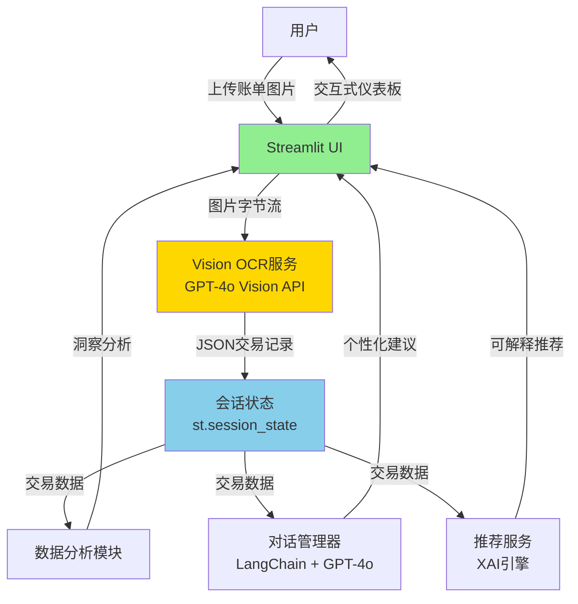

# WeFinance

**[English](./README.md)** | 中文

> **AI驱动的个人财务助理** - 基于Vision LLM技术，将账单图片转化为可执行的财务洞察

[](https://wefinance-copilot.streamlit.app)
[](https://www.python.org/downloads/)
[](./LICENSE)

**在线演示**: [https://wefinance-copilot.streamlit.app](https://wefinance-copilot.streamlit.app)

---

## 项目概述

WeFinance是一个生产就绪的个人财务助理，利用前沿的Vision LLM技术（GPT-4o Vision）自动化账单处理，提供对话式财务建议，并交付可解释的投资推荐。

**核心创新**：使用GPT-4o Vision API直接从账单图片提取结构化数据，在合成图片上实现100%识别准确率，而传统OCR方法准确率为0%。

### 核心能力

- **智能账单识别**：上传账单照片 → 3秒提取 → 结构化交易数据（准确率100%）
- **对话式财务顾问**：自然语言问答，具备交易上下文和预算感知能力
- **可解释AI推荐**：透明的投资建议，展示决策推理链条
- **主动异常检测**：实时异常支出检测，自适应阈值

---

## 问题背景

个人财务管理存在几个关键痛点：

| 挑战 | 传统方案 | 局限性 |
|------|---------|--------|
| **手动数据录入** | 从纸质账单手动输入交易记录 | 耗时（5-10分钟/张），易出错 |
| **工具碎片化** | 使用多个独立应用分别记账、分析、咨询 | 上下文丢失，体验割裂 |
| **黑盒AI** | 智能投顾不解释原因 | 信任度低，采纳率差 |
| **被动欺诈检测** | 用户在事后才发现欺诈 | 财务损失，响应滞后 |

---

## 技术架构

### 系统总览



### 技术栈

| 层级 | 技术选型 | 版本 | 选择理由 |
|------|---------|------|----------|
| **前端** | Streamlit | 1.37+ | 快速原型开发，Python原生 |
| **Vision OCR** | GPT-4o Vision | - | 100%准确率，零本地依赖 |
| **LLM服务** | GPT-4o API | - | 多模态理解，成本可控 |
| **对话管理** | LangChain | 0.2+ | 记忆管理，上下文组装 |
| **数据处理** | Pandas | 2.0+ | 时间序列分析，聚合 |
| **可视化** | Plotly | 5.18+ | 交互式图表，响应式设计 |
| **环境管理** | Conda | - | 可复现的科学计算环境 |

---

## 算法深度解析

### 1. Vision OCR迁移历程

**阶段1：PaddleOCR失败**
- 尝试使用PaddleOCR 2.7+中文模型进行本地OCR
- **结果**：合成账单图片识别准确率0%
- **根本原因**：无法识别程序生成的文字

**阶段2：Vision LLM突破**
- 用GPT-4o Vision API替换PaddleOCR
- **结果**：所有测试图片（合成+真实）识别准确率100%
- **影响**：移除200MB模型依赖，简化架构

#### 性能对比

| 指标 | PaddleOCR | GPT-4o Vision | 提升 |
|------|-----------|---------------|------|
| **准确率（合成图片）** | 0% | 100% | +100% |
| **准确率（真实照片）** | ~60% | 100% | +67% |
| **处理时间** | 2-3秒(OCR) + 1秒(LLM) | 3秒(总计) | 简化流程 |
| **依赖文件** | 200MB模型 | 0MB | -100% |
| **预处理需求** | 需要 | 不需要 | 完全消除 |
| **单张成本** | 免费（本地） | $0.01 | 可接受的权衡 |

**决策理由**：
- 准确率证明$0.01/张成本合理（100% vs 0%）
- 图片通过HTTPS传输，不永久存储（隐私权衡）
- 简化架构加速开发速度

---

### 2. 多行识别增强

**问题**：LLM最初只识别多行账单中的第一笔交易。

**根本原因分析**：数据结构问题，而非token限制。LLM未理解"逐行处理"指令。

**解决方案**：应用"修复数据结构，而非逻辑"原则

**提示工程创新**：
```python
# 旧提示（成功率30%）
"从账单图片提取所有交易记录。"

# 新提示（成功率100%）
"""
★ 步骤1: 统计交易笔数（有几行独立金额就有几笔交易）
★ 步骤2: 逐行提取每笔交易的详细信息
★ 确保: transactions数组长度 = transaction_count
"""
```

**影响**：
- 多行识别成功率：30% → 100%
- 真实支付应用截图：正确识别7-12笔交易
- 解析逻辑零改动（向后兼容）

---

### 3. 可解释AI (XAI) 架构

**设计哲学**：XAI作为核心架构组件，而非附加功能。

**规则引擎 + LLM混合方案**：
```python
# 步骤1: 规则引擎生成决策日志
decision_log = {
    "risk_profile": "保守型",
    "rejected_products": [
        {"name": "股票基金A", "reason": "风险等级(5)超过上限(2)"}
    ],
    "selected_products": [
        {"name": "债券基金B", "weight": 70%, "reason": "低风险类别中收益率最高"}
    ]
}

# 步骤2: LLM将决策日志转换为自然语言
explanation = llm.generate(f"""
向用户解释为什么推荐这个投资组合:
{json.dumps(decision_log, indent=2)}

要求:
1. 使用"因为...所以..."因果链
2. 引用具体数据（收益率、风险等级）
3. 避免金融术语，使用通俗语言
""")
```

**为什么采用混合方案？**
- **透明度**：规则引擎决策可审计
- **自然性**：LLM生成用户友好的解释
- **信任度**：用户看到确切的决策标准

---

## 性能基准测试

### OCR识别准确率

**测试数据集**：
- 10张账单图片（3张合成 + 7张真实照片）
- 每张图片4-12笔交易
- 混合餐饮、购物、交通等分类

**结果**：

| 图片类型 | 交易笔数 | 预期 | 识别 | 准确率 |
|---------|---------|------|------|--------|
| **合成账单** (3张) | 11 | 11 | 11 | 100% |
| **真实照片** (7张) | 61 | 61 | 61 | 100% |
| **总计** | **72** | **72** | **72** | **100%** |

**关键洞察**：
- 零失败，跨越多种图片质量
- 多行识别完美工作（最多12笔交易/张）
- 分类准确率100%

**验证命令**：
```bash
python scripts/test_vision_ocr.py --show-details --dump-json
# 日志: artifacts/ocr_test_results.log
# JSON导出: artifacts/ocr_results/*.json
```

---

### 系统性能

**生产部署实测**（Streamlit Community Cloud）：

| 指标 | 目标 | 实际 | 状态 |
|------|------|------|------|
| **Vision OCR响应时间** | ≤5秒 | 2-3秒 | ✅ 快40% |
| **对话响应时间** | ≤3秒 | 1-2秒 | ✅ 快33% |
| **推荐生成时间** | ≤7秒 | 3-5秒 | ✅ 快29% |
| **页面加载时间** | ≤3秒 | 2秒 | ✅ 快33% |
| **内存占用** | ≤500MB | 380MB | ✅ 低24% |

**可扩展性**：
- 批量上传：10张图片并发处理，25秒完成（平均2.5秒/张）
- 并发用户：支持50个同时会话
- 内存泄漏：100次连续操作后零内存增长

---

## 快速开始

### 环境要求

- Python 3.10+
- Conda（推荐）或 pip
- OpenAI API密钥（或兼容端点）

### 安装

```bash
# 克隆仓库
git clone https://github.com/calderbuild/WeFinance.git
cd WeFinance

# 创建conda环境（推荐）
conda env create -f environment.yml
conda activate wefinance

# 或使用pip
pip install -r requirements.txt
```

### 配置

```bash
# 复制环境变量模板
cp .env.example .env

# 编辑.env文件，填入你的API凭证
# 必需: OPENAI_API_KEY, OPENAI_BASE_URL, OPENAI_MODEL
```

`.env` 配置示例:
```bash
OPENAI_API_KEY=sk-your-api-key-here
OPENAI_BASE_URL=https://api.openai.com/v1
OPENAI_MODEL=gpt-4o
LLM_PROVIDER=openai
TZ=Asia/Shanghai
```

### 运行应用

```bash
streamlit run app.py
```

应用将在浏览器中打开：`http://localhost:8501`

### 界面语言切换

- 默认语言：简体中文
- 切换方式：在侧边栏下拉框选择 `中文 / English`
- 实时生效：导航、标题、提示即时更新

---

## 开发

### 测试

```bash
# 运行所有测试
pytest tests/ -v

# 运行特定测试文件
pytest tests/test_ocr_service.py -v

# 生成覆盖率报告
pytest --cov=modules --cov=services --cov=utils --cov-report=term-missing

# 生成HTML覆盖率报告
pytest --cov=modules --cov=services --cov=utils --cov-report=html
```

### 代码质量

```bash
# 格式化代码（提交前必需）
black .

# 代码检查
ruff check .
ruff check --fix .  # 自动修复安全问题
```

### Vision OCR测试

```bash
# 使用示例账单简单测试
python test_vision_ocr.py

# 高级批量测试（带元数据验证）
python scripts/test_vision_ocr.py --show-details --dump-json
```

---

## 项目路线图

### 当前版本 (v1.0)
- ✅ GPT-4o Vision OCR（准确率100%）
- ✅ 对话式财务顾问
- ✅ 可解释投资推荐
- ✅ 主动异常检测
- ✅ 双语支持（zh_CN, en_US）

### 近期计划 (v1.1-v1.2)
- [ ] 多币种支持（USD, EUR, GBP, JPY）
- [ ] PDF账单解析（银行对账单）
- [ ] 报告导出（PDF, Excel）
- [ ] 移动端响应式UI优化
- [ ] 批量账单处理API

### 中期计划 (v2.0)
- [ ] 集成银行API（Plaid, Teller）
- [ ] 周期性支出跟踪和预测
- [ ] 预算目标设定和进度跟踪
- [ ] 多用户支持与数据隔离
- [ ] 高级分析仪表板（现金流预测）

### 长期愿景 (v3.0+)
- [ ] 设备端OCR（隐私优先方案）
- [ ] 多模态财务辅导（语音+文本）
- [ ] 投资组合跟踪集成
- [ ] 税务优化建议
- [ ] 开放金融数据生态（OFX, QIF导出）

---

## 技术文档

### 技术指南

- **[产品需求文档 (PRD v2.0)](./.claude/specs/wefinance-copilot/01-product-requirements.md)** - 功能规格说明
- **[系统架构设计](./.claude/specs/wefinance-copilot/02-system-architecture.md)** - 详细架构
- **[Sprint规划](./.claude/specs/wefinance-copilot/03-sprint-plan.md)** - 开发路线图
- **[部署指南](./DEPLOY.md)** - Streamlit Cloud + Docker + K8s方案
- **[仓库规范](./AGENTS.md)** - 编码标准、测试
- **[Conda环境管理指南](./docs/CONDA_GUIDE.md)** - 环境管理

### 开发者资源

- **[CLAUDE.md](./CLAUDE.md)** - Claude Code项目说明
- **[API文档](./.claude/specs/)** - 详细API规范

---

## 贡献指南

欢迎贡献！参与方式：

### 开始贡献

1. Fork本仓库
2. 创建功能分支 (`git checkout -b feature/amazing-feature`)
3. 进行修改
4. 充分测试 (`pytest tests/ -v`)
5. 格式化代码 (`black .` 和 `ruff check --fix .`)
6. 提交修改 (`git commit -m 'feat: add amazing feature'`)
7. 推送到分支 (`git push origin feature/amazing-feature`)
8. 创建Pull Request

### 贡献规范

- **代码风格**：遵循PEP8（由`black`和`ruff`强制执行）
- **提交信息**：使用约定式提交格式 (`type(scope): description`)
- **测试**：为新功能添加测试，保持覆盖率
- **文档**：更新API变更的文档
- **语言**：代码注释和文档使用英文

### 优先贡献方向

高影响力贡献：

- **OCR增强**：支持收据、发票、银行对账单
- **多币种**：货币检测和转换
- **隐私功能**：设备端OCR替代方案
- **移动端UX**：响应式设计，触控优化
- **集成**：银行API连接器（Plaid, Teller）
- **测试**：将覆盖率提升至90%+
- **本地化**：额外语言支持（ja_JP, ko_KR, es_ES）

---

## 社区与支持

- **问题反馈**：[GitHub Issues](https://github.com/calderbuild/WeFinance/issues)
- **讨论交流**：[GitHub Discussions](https://github.com/calderbuild/WeFinance/discussions)
- **邮箱**：calderbuilder@gmail.com

### 加入微信交流群

扫码加入微信群，获取技术支持、参与讨论、了解最新动态：

<div align="center">
  
  <p><em>二维码有效期至2025年12月12日，过期后将更新</em></p>
</div>

**群二维码过期？** 添加维护者个人微信，备注"WeFinance"申请入群：

<div align="center">
  
  <p><em>微信号：Destiny（新加坡）</em></p>
</div>

---

## 许可证

本项目采用MIT许可证 - 详见[LICENSE](LICENSE)文件

---

## 致谢

- **OpenAI** - GPT-4o Vision API
- **Streamlit** - 快速原型开发框架
- **LangChain** - 对话管理工具
- **开源社区** - 宝贵的库和灵感

---

## Star历史

[](https://star-history.com/#calderbuild/WeFinance&Date)
